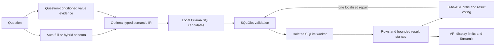

# Architecture and execution boundaries

`schema.py` inspects arbitrary local SQLite schemas, links typed columns and
foreign-key graph paths, and performs bounded read-only value probes. The three
benchmark settings are full schema, linking, and linking with correction.
`agent.py` makes at most three generation attempts. A schema error can expand the
schema supplied on correction. An executable empty result terminates successfully;
only scoring determines whether its answer is correct.

No model-generated SQL runs unchecked. `guardrails.py` admits supported read-only
SELECT structure and denies nested unsafe operations. `execution.py` launches a
worker with a wall-clock deadline. `worker.py` independently validates SQL, opens
SQLite read-only and installs an authorizer denying writes, attachments, extension
loading and unsafe functions. Result row/byte budget violations fail, not truncate.
Database byte hashes are checked before/after the real benchmark campaign.

`/query` exposes only the registered seeded database, not arbitrary filesystem
paths. It returns up to 100 display rows while retaining the original row count.
Benchmark execution uses the full bounded result in separate CLI worker processes;
API display truncation never feeds its scorer. `/health` checks database/model
availability. All launchers bind to localhost.

Gold SQL is executed only in the scoring stage and never passed into the agent.
Mini-Dev uses the pinned upstream row-set equality rule, which ignores ordering
and duplicates. Local guards can reject reference queries; such cases retain zero
credit in the full denominator and are explicitly categorized. Execution recovery
and correct-answer recovery are separate diagnostics. [Reproduction](REPRODUCE.md).

V7 adds an external, checksum-addressed SQLite value index, generated evidence
packets capped at 4 KB and 12 facts, validated Pydantic semantic intent, structural
candidate deduplication, bounded result summaries, and allowlisted SQLGlot repairs.
Names, descriptions, values, model output, and benchmark evidence remain untrusted.
The critic has no access to gold SQL or expected rows. Scoring-only code calculates
candidate oracle accuracy and retrieval recall after capture. V7 failed its pilot
gate, so these components are experimental and the V5 path remains the default.
